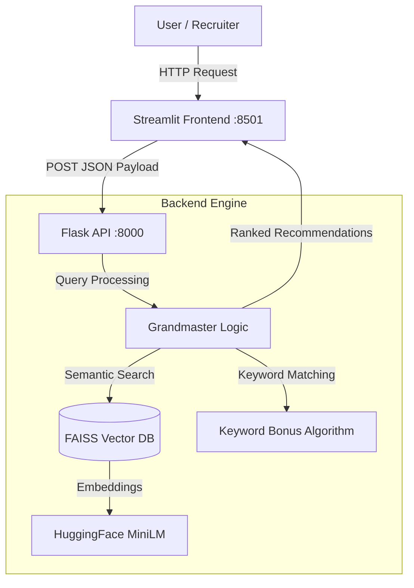

# 🏆 Intelligent Assessment Recommendation Engine


An **AI-powered Full Stack application** designed to recommend the best hiring assessments based on job descriptions or skill queries.  
It utilizes a **Hybrid Search Architecture (Semantic + Keyword)** to ensure high relevance and recall, and is fully deployed on **AWS EC2**.

---

## 📖 Table of Contents
- Architecture
- Key Features
- Tech Stack
- Installation & Local Setup
- AWS Deployment & Network Security
- API Documentation
- Project Structure
- Contact & License

---

## 🏗 Architecture



---

## 🌟 Key Features

- Hybrid Semantic + Keyword search
- FAISS-based high-speed retrieval
- Decoupled frontend and backend
- Production deployment on AWS EC2
- Smart assessment filtering

---

## 🛠 Tech Stack

| Component | Technology |
|--------|------------|
| Frontend | Streamlit |
| Backend | Flask |
| AI Model | HuggingFace MiniLM |
| Vector DB | FAISS |
| Deployment | AWS EC2 |
| Server | Gunicorn |

---

## 🚀 Installation & Local Setup

```bash
git clone https://github.com/your-username/Assessment-Recommendation-Engine.git
cd Assessment-Recommendation-Engine
python -m venv venv
source venv/bin/activate
pip install -r requirements.txt
python app.py
streamlit run frontend.py
```

---

## ☁️ AWS Deployment & Network Security

| Port | Usage |
|----|------|
| 8501 | Streamlit UI |
| 8000 | Flask API |
| 22 | SSH |
| 80 | HTTP |

---

## 🔌 API Documentation

### Health Check
GET /health

```json
{ "status": "healthy" }
```

### Recommendation API
POST /recommend

```json
{ "query": "Java Developer with SQL skills" }
```

---

## 📂 Project Structure

```bash
Assessment-Recommendation-Engine/
├── data/
├── app.py
├── frontend.py
├── requirements.txt
├── README.md
└── submission.csv
```

---

## 📧 Contact & License

Developer: Your Name  
License: MIT  
Status: ✅ Completed & Deployed
